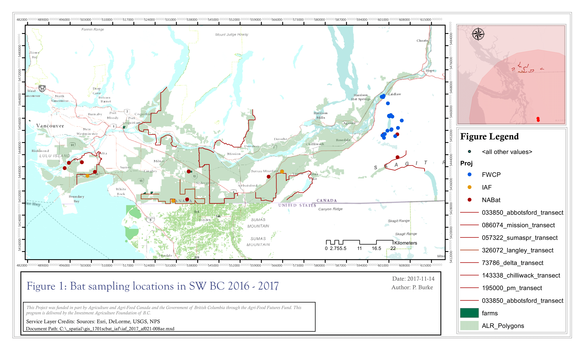
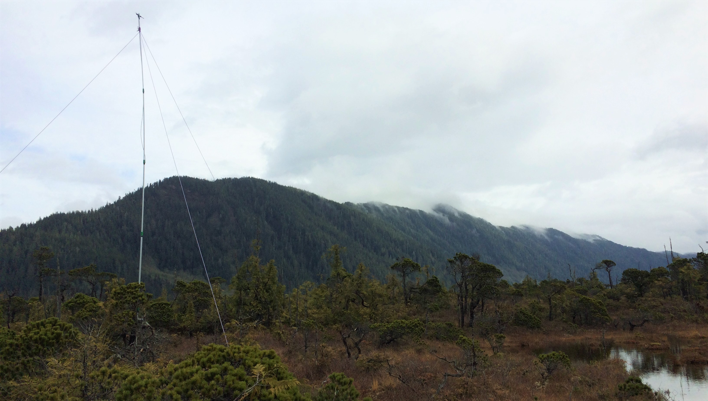

# Patrick Burke ZOOL500 Directed Studies Project
Date created: ___2017-Oct-31___   
Last modified: ___2018-Apr-03___   

## Bat Bioacoustic Data Management and Analysis in the Lower Mainland of BC 

Welcome Visitors! For this project, I will explore the use of statistical and spatial modeling techniques on acoustic datasets produced for bat inventory and monitoring projects in the Lower Mainland of British Columbia. Project partners include the BC Ministry of Environment, Wildlife Conservation Society Canada, and the South Coast Bat Conservation Society. We are collaborating to develop robust and defensible methods for detecting changes in bat population trends associated with wildlife disease and other anthropogenic impacts. Twelve of 16 bat species in BC are susceptible to the disease White-nose Syndrome (WNS), which has caused catastrophic population declines (95-99%) in bat populations in eastern North America. Conservation policy in the coming years will rely on quality data collected through these inventory and monitoring programs.    

### The products of this Directed Studies are:
1. **[Data Management:](https://github.com/burkeprw/zool500_batdatamgt/tree/master/r_scripts/t1_datamgt)** Workflow, methods, and criteria for merging bioacoustic data from multiple projects.   
2. **[Data Analysis:](https://github.com/burkeprw/zool500_batdatamgt/tree/master/r_scripts/t2_dataanaly)** Methods for preparing data for statistical analysis   
3. **[Data Archive:](https://github.com/burkeprw/zool500_batdatamgt/tree/master/r_scripts/t3_dataarchive)** Assemble data package using Ecological Metadata Language and upload to archive   
      

The purpose of this public GitHub repository is to communicate project progress to the project advisor, [Dr. Cole Burton](https://coleburton.weebly.com/), and to project collaborators. This information is provided publically to support ongoing monitoring projects to address bat conservation in BC, including power analyses to determine sample sizes required to detect population change using roost counts and NABat acoustic monitoring. Additionally, the R scripts used for data management, data anaylsis, and data archive will remain available at this repository.   

**[Figure 1](figures/fig1_zool500ds_20171114.pdf)** shows a map of regional sample locations. 

**Figure 2**: Acoustic sampling equipment in northern BC

  

## License
[MIT](https://github.com/burkeprw/zool500_batdatamgt/blob/master/LICENSE). A short and simple permissive license with conditions only requiring preservation of copyright and license notices. Licensed works, modifications, and larger works may be distributed under different terms and without source code.
