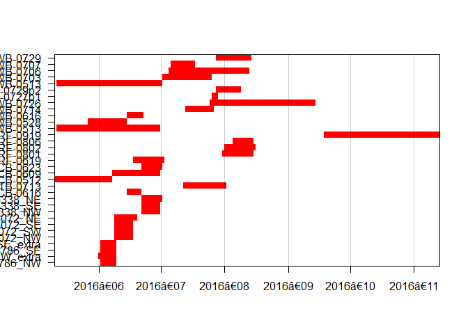

# Patrick Burke ZOOL500 Directed Studies Project
Date created: ___2017-Nov-11___   
Last modified: ___2018-Apr-04___   

## Workflow for merging bioacoustic bat data from multiple projects

### Task Summary

[Scripts and comments for managing and merging bioacoustic datasets here](https://github.com/burkeprw/zool500_batdatamgt/blob/master/r_scripts/t1_datamgt/ghd01_datamgt.md).

To summarize the data, we have:

- 38 independent sampling sites (From 3 projects)   
- 30 sampling sites with data in 2016   
- 14,906 of recorded files with potential bat calls in 2016   
- 3,197 calls identified to species in 2016      
- 10 species identified in 2016   
- Activity was spatially and temporally heterogenous across the study

**Figure 1-1:** Distribution of Acoustic Recordings Across Sampling Stations in 2016

**Figure 1-2:** Periods When Monitoring Occurred (Red) for each Sampling Station in 2016

**Table 1-1:** Number of Acoustic Files and Effort at Sampling Stations in 2016

Site           |FileCount|JNstart|SampleDays|AdjEffort
---------------|---------|-------|----------|----------
073786_NW	     |369	     |155	   |7         |105.4285714
073786_NW_extra|195	     |154	   |8         |48.7500000
073786_SE	     |688	     |155    |7         |196.5714286
073786_SE_extra|2325	   |155    |7         |332.1428571
143338_NE	     |267	     |175	   |9	        |29.6666667
143338_NW	     |164      |175	   |8	        |20.5000000
143338_SE	     |36	     |175	   |8	        |4.5000000
326072_NE	     |1092     |162	   |10	      |218.4000000
326072_NW	     |691	     |162	   |8	        |172.7500000
326072_SE	     |252	     |162	   |8	        |63.0000000
326072_SW	     |1193	   |162	   |8	        |298.2500000
BCB-0616	     |17	     |169	   |6	        |2.8333333
CTB-0713	     |206	     |195	   |20	      |10.3000000
FCB-0512	     |676	     |133	   |27	      |25.0370370
FCB-0609	     |107	     |161	   |22	      |4.8636364
FCB-0623	     |421	     |175	   |9	        |46.7777778
FRF-0619	     |4390	   |171	   |14	      |313.5714286
FRF-0801	     |788	     |214	   |14	      |56.2857143
FRF-0806	     |456	     |219	   |9	        |50.6666667
FRF-0919	     |7	       |296	   |55	      |0.1272727
LWB-0513	     |486	     |134	   |49	      |9.9183673
LWB-0528	     |585	     |149	   |18	      |32.5000000
LWB-0616	     |97	     |168	   |7	        |13.8571429
LWB-0714	     |613	     |196	   |13	      |47.1538462
LWB-0726	     |677	     |245	   |50	      |13.5400000
UWB-0513	     |1998	   |133	   |50	      |39.9600000
UWB-0703	     |243	     |185	   |23	      |10.5652174
UWB-0706	     |444	     |188	   |38	      |11.6842105
UWB-0707	     |126	     |189	   |11	      |11.4545455
UWB-0729	     |607	     |211	   |16	      |37.9375000
