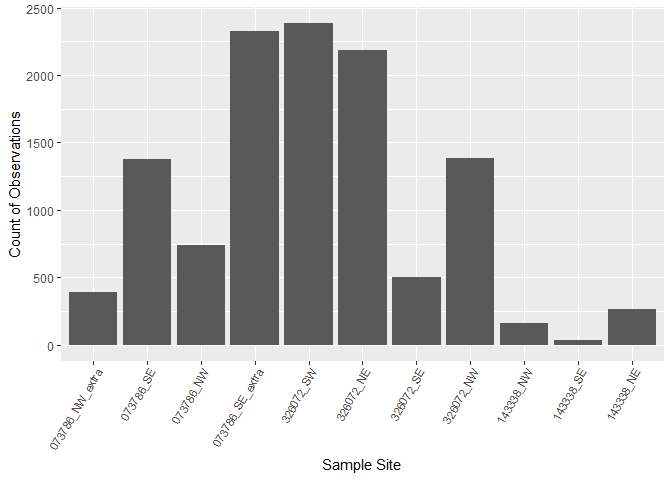
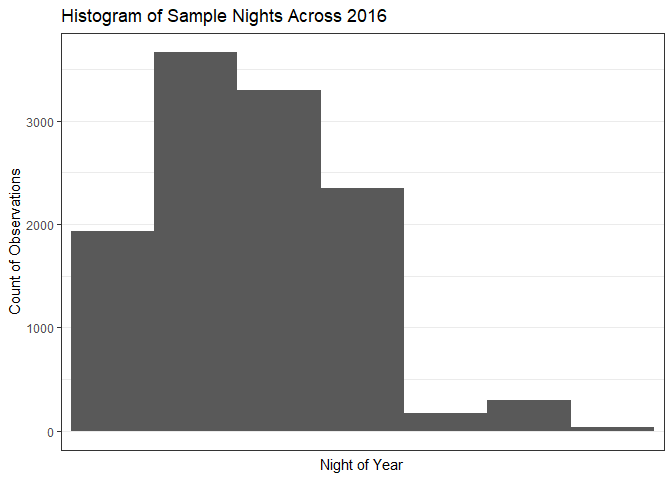

Data Management
================
burkeprw
April 04, 2018

### Data Preparation and Merging

Standardized format and documentation methods are required for collating data from different projects. Here I identify the minimum criteria for the merging data sets and a workflow for preparing the data. Then I use the workflow in a case study to merge data from two projects. Through the case study I provide scripts for editing, organizing, and merging data tables from multiple projects.

##### Minimum Data Criteria

Data need to be in flat, tabular format. The preferred file format is comma-delimited with UTF-8 encoding. This format is machine-readable, simple, and flexible. The file name should have no special characters or spaces. An example: `data_project2018.csv`

Generally project data will come in two seperate tables: one containing **site information** and one containing **observations**. It is easiest to work with these tables individually before merging the data.

##### Example Site Data Table

<table style="width:44%;">
<colgroup>
<col width="2%" />
<col width="2%" />
<col width="2%" />
<col width="2%" />
<col width="2%" />
<col width="2%" />
<col width="2%" />
<col width="2%" />
<col width="2%" />
<col width="2%" />
<col width="2%" />
<col width="2%" />
<col width="2%" />
<col width="2%" />
<col width="2%" />
<col width="2%" />
</colgroup>
<thead>
<tr class="header">
<th>Station</th>
<th>Project</th>
<th>Organization</th>
<th>Zone</th>
<th>UTMe</th>
<th>UTMn</th>
<th>DateStart</th>
<th>DateEnd</th>
<th>DetModel</th>
<th>MicType</th>
<th>TrigWin</th>
<th>MaxLgh</th>
<th>SiteCov1</th>
<th>...</th>
</tr>
</thead>
<tbody>
<tr class="odd">
<td>PBM1805D</td>
<td>FWCP</td>
<td>SCBat</td>
<td>WGS84</td>
<td>48.000</td>
<td>-121.000</td>
<td>2017-03-15</td>
<td>2017-10-15</td>
<td>SM2</td>
<td>SMX-US</td>
<td>2</td>
<td>15</td>
<td>4.7812</td>
<td>0.982</td>
</tr>
<tr class="even">
<td>...</td>
<td></td>
<td></td>
<td></td>
<td></td>
<td></td>
<td></td>
<td></td>
<td></td>
<td></td>
<td></td>
<td></td>
<td></td>
<td></td>
</tr>
<tr class="odd">
<td>...</td>
<td></td>
<td></td>
<td></td>
<td></td>
<td></td>
<td></td>
<td></td>
<td></td>
<td></td>
<td></td>
<td></td>
<td></td>
<td></td>
</tr>
</tbody>
</table>

The site data table contains all of the spatial and contextual information about where and when sampling occurred. The minimum required site data attributes (columns) include:

-   **Station**: Unique site name for each sampling station \[character, converted to factor below\]
-   **Proj**: Unique project name or code \[character, converted to factor below\]
-   **Org**: Organization responsible for collecting the data \[character\]
-   **Datum**: Geodetic datum \[character\]
-   **UTMe**: UTM easting, meters \[integer\]
-   **UTMn**: UTM northing, meters \[integer\]
-   **DateSt**: Date when sampling began \[POSIXct YYYY-MM-DD\]
-   **DateEnd**: Date when sampling began \[POSIXct YYYY-MM-DD\]
-   **DetMod**: Model of detector used to record data \[character\]
-   **MicType**: Microphone type used to record data \[character\]
-   **MicSens**: A measure of microphone sensitivity. \[double\]
-   **TrigWin**: The trigger window set on the detector \[integer\]
-   **MaxL**: Maximum file length, seconds \[integer\]
-   **SiteCov1**: Site covariates may include:
    -   A measure of environmental clutter within the microphone sampling area
    -   Percent canopy openness
    -   Whether a sound dampener or microphone was used

##### Example Observation Data Table

| Station  | Species | DateTime                 |
|----------|---------|--------------------------|
| PBM1805D | MYLU    | 2017-06-21 03:34:35.2219 |
| ...      |         |                          |
| ...      |         |                          |

The site data table contains all of the spatial and contextual information about where and when sampling occurred. Note that the Station is the common attribute we will use to join the site and observation date. The formatting and station name must match in boh tables. The minimum required site data attributes (columns) include:

-   **Station**: Unique site name for each sampling station \[character, converted to factor below\]
-   **Species**: Species code (4-letter) or acoustic guild \[character, converted to factor below\]
-   **DateTime**: Date and time the observation was made \[POSIXct YYYY-MM-DD HH:MM:SS.ms\]

### Case Study Step 1: Read in Passive Acoustic Data from Multiple Projects

The examples above include minimum criteria. Additional attributes and covariates will be useful to include for ecological modeling. Here I will prepare actual data using the minimum criteria from three projects. For each project, monitoring data was collected using passsive acoustic monitoring devices with ultrasonic microphones. Data were analyzed using automated classification software and by hand using cosistent methods.

##### 1. Fish and Wildlife Compensation Program

-   Passive data from 23 sampling sites across 1 year \[459 total sample days\]

##### 2. North American Bat Monitoring Program

-   Passive data from 20 sampling sites across 2 years \[100 total sample days\]
-   Missing data from additional 4 sampling sites across 2 years: Mission-086074
-   Additional Monitoring in 2018 planned

##### 3. Investment Agriculture Foundation

-   Passive data available from 3 sampling sites across 1 year \[274 total sample days\]
-   **Not analyzed: to be incorporated later**
-   Additional Monitoring in 2018 planned

See **[Figure 1](figures/nabat_2017_BCBAT.pdf)** showing sampling locations.

``` r
suppressPackageStartupMessages(library(tidyverse))
suppressPackageStartupMessages(library(lubridate))
suppressPackageStartupMessages(library(readr))
suppressPackageStartupMessages(library(rgdal)) # for spatial points conversion
suppressPackageStartupMessages(library(sp)) # for spatial points conversion
suppressPackageStartupMessages(library(forcats))
suppressPackageStartupMessages(library(unmarked))
```

First, I read in the site data from Project 1 (FWCP). The resulting data frame contains 22 sites with 12 attributes (columns).

Use `read_csv()` (located in the `tidyverse` package) and identify the type of data within each column, including date formats and "NA" and "NaN" strings. The dates are converted to an integer representing the day of the year in decimal format to facilitate comparisons across years. Finally, use `dplyr::select()` (located in the `tidyverse` package) to choose the attributes (columns) to retain, to reorder the columns, and to rename the column headings. For example: `%>% select(Station=Site, Project=Proj, ... )`.

``` r
sites.df <- read_csv("./data/dat_pbmsites_fwcp.csv", col_names = TRUE, 
                       col_types = cols_only(
                           Proj = col_character(),
                           Site = col_character(),
                           Site_name = col_character(),
                           utm_zone = col_character(),
                           utm_easting = col_double(),
                           utm_northing = col_double(),
                           Elev = col_double(),
                           Surv_yr = col_integer(),
                           start_date = col_date(format = "%Y-%m-%d"),
                           end_date = col_date(format = "%Y-%m-%d"),
                           Problem1_from = col_date(format = "%Y-%m-%d"),
                           Problem1_to = col_date(format = "%Y-%m-%d"),
                           init = col_character(),
                           det_model = col_character(),
                           det_sn = col_character(),
                           mic_type = col_character(),
                           mic_sn = col_character(),
                           windsc = col_logical(),
                           dampn = col_logical(),
                           mic_sens = col_double(),
                           rec_mode = col_character(),
                           trig_win = col_integer(),
                           max_lngth = col_integer(),
                           mic_ht = col_double(),
                           qual_clutt = col_double(),
                           dens = col_logical(),
                           GLA = col_double(),
                           LAI.4 = col_double(),
                           LAI.5 = col_double(),
                           noise = col_character(),
                           comments = col_character() ),
                       locale = default_locale(), na = c("NaN", "NA")) 
sites.df$Org<-"SCBats" # add a column to identify the organization responsible for collecting the data
sites.df$Datum<-"WGS84" # add a column to identify the map datum for the project

sites_fwcp_tidy <- sites.df %>%
  mutate(NOYstart = yday(start_date)) %>%
  mutate(NOYend = yday(end_date)) %>%
  mutate(SampDay = NOYend - NOYstart - 1) %>%
  select(Station = Site,
         Proj,Org,Datum,
         UTMe = utm_easting,
         UTMn = utm_northing,
         DateStart = start_date,
         DateEnd = end_date,
         MicTyp = mic_type,
         DetMod = det_model,
         TrgWin = trig_win,
         MaxL = max_lngth)

dim(sites_fwcp_tidy)
```

    ## [1] 22 12

Here I read the obesrvation data for Project 1 (NABat). Our resulting data frame will have 12,944 observations in 5 columns. Remember to:
\* Identify data types
\* Make adjustments using [tidy data](http://vita.had.co.nz/papers/tidy-data.html) practices (Wickham 2014)
\* Calculate the number of samples (e.g. nights of completed recording)
\* Rename, reorganize, and identify the type of data within each column

``` r
obs.df <- read_csv('./data/dat_pbmobserv_fwcp.csv', col_names = TRUE, 
                      col_types = cols_only(
                          Site = col_character(),
                          file_zc = col_character(),
                          type = col_integer(),
                          ID = col_integer(),
                          Divrat = col_integer(),
                          Date = col_date(),
                          Night = col_date(),
                          DateTimeOriginal = col_datetime(format = "%Y-%m-%d %H:%M:%S"),
                          Elev = col_double(),
                          Tape = col_character(),
                          Note = col_character(),
                          Sp_final = col_character()),
                      locale = default_locale(), na = c("NaN", "NA")) 

obs_fwcp_tidy <- obs.df%>%
  mutate(NOY = yday(Night)) %>% # Converts date to decimal night of the year (integer)
  mutate(Count = 1) %>% # add column for number of bat passes. Each observation in data is one pass
  select(Station = Site,
         Species = Sp_final,
         DateTime = DateTimeOriginal,
         NOY,Count)
  #filter(Species_final == "TABR" | Species_final == "MYLU" | Species_final == "LANO") # filter for species of interest

dim(obs_fwcp_tidy)
```

    ## [1] 12944     5

These methods are used to read in data from all other projects. This occurs under the hood for readability here, but the same script may be used for other data sets. Be mindful of data types and column headings.

### Case Study Step 2: Combine Data Sets

The next step is to combine the data sets, make categorical variables factors, and save the data frame to file. A few things to keep in mind: \* First bind the site data frames together from multiple projects \* Use `dplyr::bind_rows()` \* Confirm that the number of columns (attributes) for sites is 12 and for observations is 5

``` r
sites_bats <- bind_rows(sites_nabat_tidy, sites_fwcp_tidy, sites_iaf_tidy)
obs_bats <- bind_rows(obs_nabat_tidy, obs_fwcp_tidy)

dim(sites_bats)
```

    ## [1] 45 12

``` r
dim(obs_bats)
```

    ## [1] 20216     5

Then join the site and observation data using `dplyr:full_join()` which preserves all rows and columns. Calculate metrics for the number of sample days (**SampDays**) and the sample effort adjusted for the amount of days sampled (**SampEft**). Finally, write the files using `saveRDS()` to preserve the factor levels

``` r
all_dat <- full_join(obs_bats,sites_bats, by = "Station") %>%
  group_by(Station) %>%
  mutate(NumFiles = length(NOY)) %>%
  mutate(SampDays = as.integer(DateEnd - DateStart)) %>%
  mutate(SampEft = NumFiles / SampDays)

all_dat_fct <- all_dat %>%
  mutate(Proj.fct = as_factor(Proj)) %>%
  mutate(Station.fct = as_factor(Station))

str(all_dat_fct)
```

    ## Classes 'grouped_df', 'tbl_df', 'tbl' and 'data.frame':  24704 obs. of  21 variables:
    ##  $ Station    : chr  "143338_NE" "143338_NE" "143338_NE" "143338_NE" ...
    ##  $ Species    : chr  "20K" "20K" "20K" "20K" ...
    ##  $ DateTime   : POSIXct, format: "2016-06-23 21:41:25" "2016-06-28 03:18:40" ...
    ##  $ NOY        : num  175 179 179 180 180 183 183 175 177 177 ...
    ##  $ Count      : num  1 1 1 1 1 1 1 1 1 1 ...
    ##  $ Proj       : chr  "NABat" "NABat" "NABat" "NABat" ...
    ##  $ Org        : chr  "SCBats" "SCBats" "SCBats" "SCBats" ...
    ##  $ Datum      : chr  "WGS84" "WGS84" "WGS84" "WGS84" ...
    ##  $ UTMe       : num  603746 603746 603746 603746 603746 ...
    ##  $ UTMn       : num  5450650 5450650 5450650 5450650 5450650 ...
    ##  $ DateStart  : Date, format: "2016-06-23" "2016-06-23" ...
    ##  $ DateEnd    : Date, format: "2016-07-02" "2016-07-02" ...
    ##  $ MicTyp     : chr  "SMX-U1" "SMX-U1" "SMX-U1" "SMX-U1" ...
    ##  $ DetMod     : chr  "SM2" "SM2" "SM2" "SM2" ...
    ##  $ TrgWin     : int  2 2 2 2 2 2 2 2 2 2 ...
    ##  $ MaxL       : int  15 15 15 15 15 15 15 15 15 15 ...
    ##  $ NumFiles   : int  267 267 267 267 267 267 267 267 267 267 ...
    ##  $ SampDays   : int  9 9 9 9 9 9 9 9 9 9 ...
    ##  $ SampEft    : num  29.7 29.7 29.7 29.7 29.7 ...
    ##  $ Proj.fct   : chr  "NABat" "NABat" "NABat" "NABat" ...
    ##  $ Station.fct: chr  "143338_NE" "143338_NE" "143338_NE" "143338_NE" ...
    ##  - attr(*, "vars")= chr "Station"
    ##  - attr(*, "labels")='data.frame':   38 obs. of  1 variable:
    ##   ..$ Station: chr  "057322_NE" "057322_NW" "073786_NW" "073786_NW_extra" ...
    ##   ..- attr(*, "vars")= chr "Station"
    ##   ..- attr(*, "drop")= logi TRUE
    ##  - attr(*, "indices")=List of 38
    ##   ..$ : int 24697
    ##   ..$ : int 24696
    ##   ..$ : int  9248 9249 9250 9251 9252 9253 9254 9255 9256 9257 ...
    ##   ..$ : int  11362 11363 11364 11365 11366 11367 11368 11369 11370 11371 ...
    ##   ..$ : int  9986 9987 9988 9989 9990 9991 9992 9993 9994 9995 ...
    ##   ..$ : int  6923 6924 6925 6926 6927 6928 6929 6930 6931 6932 ...
    ##   ..$ : int  0 1 2 3 4 5 6 7 8 9 ...
    ##   ..$ : int  267 268 269 270 271 272 273 274 275 276 ...
    ##   ..$ : int  431 432 433 434 435 436 437 438 439 440 ...
    ##   ..$ : int  467 468 469 470 471 472 473 474 475 476 ...
    ##   ..$ : int  2651 2652 2653 2654 2655 2656 2657 2658 2659 2660 ...
    ##   ..$ : int  4033 4034 4035 4036 4037 4038 4039 4040 4041 4042 ...
    ##   ..$ : int  4537 4538 4539 4540 4541 4542 4543 4544 4545 4546 ...
    ##   ..$ : int  11752 11753 11754 11755 11756 11757 11758 11759 11760 11761 ...
    ##   ..$ : int 24701
    ##   ..$ : int  11769 11770 11771 11772 11773 11774 11775 11776 11777 11778 ...
    ##   ..$ : int  11975 11976 11977 11978 11979 11980 11981 11982 11983 11984 ...
    ##   ..$ : int  12651 12652 12653 12654 12655 12656 12657 12658 12659 12660 ...
    ##   ..$ : int  12758 12759 12760 12761 12762 12763 12764 12765 12766 12767 ...
    ##   ..$ : int  13179 13180 13181 13182 13183 13184 13185 13186 13187 13188 ...
    ##   ..$ : int  17569 17570 17571 17572 17573 17574 17575 17576 17577 17578 ...
    ##   ..$ : int 24698
    ##   ..$ : int  18357 18358 18359 18360 18361 18362 18363 18364 18365 18366 ...
    ##   ..$ : int  18813 18814 18815 18816 18817 18818 18819
    ##   ..$ : int  18820 18821 18822 18823 18824 18825 18826 18827 18828 18829 ...
    ##   ..$ : int  19306 19307 19308 19309 19310 19311 19312 19313 19314 19315 ...
    ##   ..$ : int  19891 19892 19893 19894 19895 19896 19897 19898 19899 19900 ...
    ##   ..$ : int  19988 19989 19990 19991 19992 19993 19994 19995 19996 19997 ...
    ##   ..$ : int  20601 20602 20603 20604 20605 20606 20607 20608 20609 20610 ...
    ##   ..$ : int 24699
    ##   ..$ : int 24700
    ##   ..$ : int 24703
    ##   ..$ : int  21278 21279 21280 21281 21282 21283 21284 21285 21286 21287 ...
    ##   ..$ : int  23276 23277 23278 23279 23280 23281 23282 23283 23284 23285 ...
    ##   ..$ : int  23519 23520 23521 23522 23523 23524 23525 23526 23527 23528 ...
    ##   ..$ : int  23963 23964 23965 23966 23967 23968 23969 23970 23971 23972 ...
    ##   ..$ : int  24089 24090 24091 24092 24093 24094 24095 24096 24097 24098 ...
    ##   ..$ : int 24702
    ##  - attr(*, "drop")= logi TRUE
    ##  - attr(*, "group_sizes")= int  1 1 738 390 1376 2325 267 164 36 2184 ...
    ##  - attr(*, "biggest_group_size")= int 4390

Finally, the merged data is saved as a file using `saveRDS()`. The file `all_obs_full.rds` is a serialzed object in a binary file, only readable in R. You may want to also write the file as a csv, but the factor levels will be lost. Better is to save the '.rds' and use `readRDS()` to read the file.

The file contains complete information about the location and bat species detected at passive bioacoustic monitors recording ultrasond from multiple projects in British Columbia.

``` r
all_dat_comp <- all_dat_fct[complete.cases(all_dat_fct[ , 3]), ] # This removes rows with no species ID

saveRDS(all_dat_comp, "./data/all_obs_comp.rds")
#write_csv(all_obs_comp, "all_obs.csv")
#all_obs_full_read <- readRDS("all_obs_full.rds")
```

### Data exploration and QAQC

Briefly, I will explore these data and summarize by site and species.

``` r
str(all_dat_comp) # Step 1. Check the data frame structure
```

    ## Classes 'grouped_df', 'tbl_df', 'tbl' and 'data.frame':  11752 obs. of  21 variables:
    ##  $ Station    : chr  "143338_NE" "143338_NE" "143338_NE" "143338_NE" ...
    ##  $ Species    : chr  "20K" "20K" "20K" "20K" ...
    ##  $ DateTime   : POSIXct, format: "2016-06-23 21:41:25" "2016-06-28 03:18:40" ...
    ##  $ NOY        : num  175 179 179 180 180 183 183 175 177 177 ...
    ##  $ Count      : num  1 1 1 1 1 1 1 1 1 1 ...
    ##  $ Proj       : chr  "NABat" "NABat" "NABat" "NABat" ...
    ##  $ Org        : chr  "SCBats" "SCBats" "SCBats" "SCBats" ...
    ##  $ Datum      : chr  "WGS84" "WGS84" "WGS84" "WGS84" ...
    ##  $ UTMe       : num  603746 603746 603746 603746 603746 ...
    ##  $ UTMn       : num  5450650 5450650 5450650 5450650 5450650 ...
    ##  $ DateStart  : Date, format: "2016-06-23" "2016-06-23" ...
    ##  $ DateEnd    : Date, format: "2016-07-02" "2016-07-02" ...
    ##  $ MicTyp     : chr  "SMX-U1" "SMX-U1" "SMX-U1" "SMX-U1" ...
    ##  $ DetMod     : chr  "SM2" "SM2" "SM2" "SM2" ...
    ##  $ TrgWin     : int  2 2 2 2 2 2 2 2 2 2 ...
    ##  $ MaxL       : int  15 15 15 15 15 15 15 15 15 15 ...
    ##  $ NumFiles   : int  267 267 267 267 267 267 267 267 267 267 ...
    ##  $ SampDays   : int  9 9 9 9 9 9 9 9 9 9 ...
    ##  $ SampEft    : num  29.7 29.7 29.7 29.7 29.7 ...
    ##  $ Proj.fct   : chr  "NABat" "NABat" "NABat" "NABat" ...
    ##  $ Station.fct: chr  "143338_NE" "143338_NE" "143338_NE" "143338_NE" ...
    ##  - attr(*, "vars")= chr "Station"
    ##  - attr(*, "drop")= logi TRUE
    ##  - attr(*, "indices")=List of 11
    ##   ..$ : int  9248 9249 9250 9251 9252 9253 9254 9255 9256 9257 ...
    ##   ..$ : int  11362 11363 11364 11365 11366 11367 11368 11369 11370 11371 ...
    ##   ..$ : int  9986 9987 9988 9989 9990 9991 9992 9993 9994 9995 ...
    ##   ..$ : int  6923 6924 6925 6926 6927 6928 6929 6930 6931 6932 ...
    ##   ..$ : int  0 1 2 3 4 5 6 7 8 9 ...
    ##   ..$ : int  267 268 269 270 271 272 273 274 275 276 ...
    ##   ..$ : int  431 432 433 434 435 436 437 438 439 440 ...
    ##   ..$ : int  467 468 469 470 471 472 473 474 475 476 ...
    ##   ..$ : int  2651 2652 2653 2654 2655 2656 2657 2658 2659 2660 ...
    ##   ..$ : int  4033 4034 4035 4036 4037 4038 4039 4040 4041 4042 ...
    ##   ..$ : int  4537 4538 4539 4540 4541 4542 4543 4544 4545 4546 ...
    ##  - attr(*, "group_sizes")= int  738 390 1376 2325 267 164 36 2184 1382 504 ...
    ##  - attr(*, "biggest_group_size")= int 2386
    ##  - attr(*, "labels")='data.frame':   11 obs. of  1 variable:
    ##   ..$ Station: chr  "073786_NW" "073786_NW_extra" "073786_SE" "073786_SE_extra" ...
    ##   ..- attr(*, "vars")= chr "Station"
    ##   ..- attr(*, "drop")= logi TRUE

``` r
with(all_dat_comp, print(unique(Station))) # Step 2. Identify number of independent sites
```

    ##  [1] "143338_NE"       "143338_NW"       "143338_SE"      
    ##  [4] "326072_NE"       "326072_NW"       "326072_SE"      
    ##  [7] "326072_SW"       "073786_SE_extra" "073786_NW"      
    ## [10] "073786_SE"       "073786_NW_extra"

``` r
summary(all_dat_comp) # Step 3. Summary
```

    ##    Station            Species             DateTime                  
    ##  Length:11752       Length:11752       Min.   :2016-06-02 20:53:11  
    ##  Class :character   Class :character   1st Qu.:2016-06-07 22:38:22  
    ##  Mode  :character   Mode  :character   Median :2016-06-11 22:56:37  
    ##                                        Mean   :2016-06-12 07:09:40  
    ##                                        3rd Qu.:2016-06-16 05:07:41  
    ##                                        Max.   :2016-07-02 04:48:01  
    ##       NOY            Count       Proj               Org           
    ##  Min.   :154.0   Min.   :1   Length:11752       Length:11752      
    ##  1st Qu.:159.0   1st Qu.:1   Class :character   Class :character  
    ##  Median :163.0   Median :1   Mode  :character   Mode  :character  
    ##  Mean   :163.3   Mean   :1                                        
    ##  3rd Qu.:167.0   3rd Qu.:1                                        
    ##  Max.   :183.0   Max.   :1                                        
    ##     Datum                UTMe             UTMn        
    ##  Length:11752       Min.   :494202   Min.   :5428739  
    ##  Class :character   1st Qu.:504181   1st Qu.:5428739  
    ##  Mode  :character   Median :529989   Median :5438272  
    ##                     Mean   :522019   Mean   :5435919  
    ##                     3rd Qu.:534546   3rd Qu.:5439529  
    ##                     Max.   :603868   Max.   :5450713  
    ##    DateStart             DateEnd              MicTyp         
    ##  Min.   :2016-06-02   Min.   :2016-06-10   Length:11752      
    ##  1st Qu.:2016-06-03   1st Qu.:2016-06-10   Class :character  
    ##  Median :2016-06-10   Median :2016-06-20   Mode  :character  
    ##  Mean   :2016-10-28   Mean   :2016-11-05                     
    ##  3rd Qu.:2017-06-21   3rd Qu.:2017-06-29                     
    ##  Max.   :2017-06-21   Max.   :2017-06-29                     
    ##     DetMod              TrgWin       MaxL       NumFiles   
    ##  Length:11752       Min.   :2   Min.   :15   Min.   :  36  
    ##  Class :character   1st Qu.:2   1st Qu.:15   1st Qu.:1376  
    ##  Mode  :character   Median :2   Median :15   Median :2184  
    ##                     Mean   :2   Mean   :15   Mean   :1763  
    ##                     3rd Qu.:2   3rd Qu.:15   3rd Qu.:2325  
    ##                     Max.   :2   Max.   :15   Max.   :2386  
    ##     SampDays         SampEft        Proj.fct         Station.fct       
    ##  Min.   : 7.000   Min.   :  4.5   Length:11752       Length:11752      
    ##  1st Qu.: 7.000   1st Qu.:172.8   Class :character   Class :character  
    ##  Median : 8.000   Median :218.4   Mode  :character   Mode  :character  
    ##  Mean   : 7.985   Mean   :224.9                                        
    ##  3rd Qu.: 8.000   3rd Qu.:298.2                                        
    ##  Max.   :11.000   Max.   :332.1

``` r
summary(all_dat_comp$NOY)
```

    ##    Min. 1st Qu.  Median    Mean 3rd Qu.    Max. 
    ##   154.0   159.0   163.0   163.3   167.0   183.0

``` r
summary(all_dat_comp$Species)
```

    ##    Length     Class      Mode 
    ##     11752 character character

``` r
unique(all_dat_comp$Station)
```

    ##  [1] "143338_NE"       "143338_NW"       "143338_SE"      
    ##  [4] "326072_NE"       "326072_NW"       "326072_SE"      
    ##  [7] "326072_SW"       "073786_SE_extra" "073786_NW"      
    ## [10] "073786_SE"       "073786_NW_extra"

``` r
summ <- all_dat_comp %>%
  #filter(Surv_yr == 2016) %>% #Removes sites with no species obs
  filter(Station != "FRF-0802" & Station != "LWB-0727p1" & Station != "LWB-0729p2" & Station != "LWB-0919") #Removes sites with no species obs
with(summ, print(unique(Station))) 
```

    ##  [1] "143338_NE"       "143338_NW"       "143338_SE"      
    ##  [4] "326072_NE"       "326072_NW"       "326072_SE"      
    ##  [7] "326072_SW"       "073786_SE_extra" "073786_NW"      
    ## [10] "073786_SE"       "073786_NW_extra"

``` r
# IAF <- 89 + 95 + 90 #274
# NABat <- 10 + 10 + 7.5 + 8 + 7.5 + 7 + 9 + 8 + 8 + 9 + 8 + 8 #100
# FWCP <- sum(summ_all_a$SampleDays) - 274 - 100 #459

summ_a <- summ %>%
  group_by(Station) %>%
  summarize(FileCount=length(Count),NOYstart=min(NOY), SampleDays=mean(SampDays), AdjustedEffort=mean(SampEft))
head(summ_a)
```

    ## # A tibble: 6 x 5
    ##   Station         FileCount NOYstart SampleDays AdjustedEffort
    ##   <chr>               <int>    <dbl>      <dbl>          <dbl>
    ## 1 073786_NW             738     155.       7.50           98.8
    ## 2 073786_NW_extra       390     154.       8.00           48.8
    ## 3 073786_SE            1376     155.       7.50          184. 
    ## 4 073786_SE_extra      2325     155.       7.00          332. 
    ## 5 143338_NE             267     175.       9.00           29.7
    ## 6 143338_NW             164     175.       8.00           20.5

``` r
knitr::kable(summ_a)
```

| Station           |  FileCount|  NOYstart|  SampleDays|  AdjustedEffort|
|:------------------|----------:|---------:|-----------:|---------------:|
| 073786\_NW        |        738|       155|         7.5|        98.83929|
| 073786\_NW\_extra |        390|       154|         8.0|        48.75000|
| 073786\_SE        |       1376|       155|         7.5|       184.28571|
| 073786\_SE\_extra |       2325|       155|         7.0|       332.14286|
| 143338\_NE        |        267|       175|         9.0|        29.66667|
| 143338\_NW        |        164|       175|         8.0|        20.50000|
| 143338\_SE        |         36|       175|         8.0|         4.50000|
| 326072\_NE        |       2184|       162|         9.0|       245.70000|
| 326072\_NW        |       1382|       162|         8.0|       172.75000|
| 326072\_SE        |        504|       162|         9.5|        54.40909|
| 326072\_SW        |       2386|       162|         8.0|       298.25000|

``` r
summ_b <- summ %>%
  group_by(Species) %>%
  summarize(FileCount=length(Count), NOYstart=min(NOY), SampleDays = mean(SampDays), AdjustedEffort = mean(SampEft))
head(summ_b)
```

    ## # A tibble: 6 x 5
    ##   Species FileCount NOYstart SampleDays AdjustedEffort
    ##   <chr>       <int>    <dbl>      <dbl>          <dbl>
    ## 1 20K            75     155.       8.15          142. 
    ## 2 25K           167     155.       7.76          197. 
    ## 3 30K             7     164.       8.57           69.2
    ## 4 35k            19     176.       8.00           20.5
    ## 5 35K           553     155.       8.06          250. 
    ## 6 40k            18     175.       8.00           20.5

A plot of the count of observations across sites shows uneven activity across sampling locations. The sites are ordered by the first day of sampling.

``` r
p1 <- summ %>%
    ggplot(aes(x=fct_reorder(Station.fct,NOY))) +
    geom_bar() +
    scale_x_discrete("Sample Site") +
    scale_y_continuous("Count of Observations") +
   theme(axis.text.x = element_text(angle=60, hjust=1, size=8))
p1
```



A histogram of sampling effort across time shows uneven activity across sampling locations. The sites are ordered by the first day of sampling.

``` r
p2 <- summ %>%
    ggplot(aes(NOY)) + geom_histogram(binwidth = 5) +
    scale_x_discrete("Night of Year") +
    scale_y_continuous("Count of Observations") +
    ggtitle("Histogram of Sample Nights Across 2016")
p2 + theme_bw()
```



### Literature Cited

1.  H. Wickham, Tidy Data. J. Stat. Softw. 59 (2014), <doi:10.18637/jss.v059.i10>.

### Session Info

``` r
sessionInfo()
```

    ## R version 3.4.4 (2018-03-15)
    ## Platform: x86_64-w64-mingw32/x64 (64-bit)
    ## Running under: Windows 10 x64 (build 16299)
    ## 
    ## Matrix products: default
    ## 
    ## locale:
    ## [1] LC_COLLATE=English_United States.1252 
    ## [2] LC_CTYPE=English_United States.1252   
    ## [3] LC_MONETARY=English_United States.1252
    ## [4] LC_NUMERIC=C                          
    ## [5] LC_TIME=English_United States.1252    
    ## 
    ## attached base packages:
    ## [1] parallel  stats     graphics  grDevices utils     datasets  methods  
    ## [8] base     
    ## 
    ## other attached packages:
    ##  [1] bindrcpp_0.2    unmarked_0.12-2 Rcpp_0.12.16    lattice_0.20-35
    ##  [5] reshape_0.8.7   rgdal_1.2-18    sp_1.2-7        lubridate_1.7.2
    ##  [9] forcats_0.3.0   stringr_1.3.0   dplyr_0.7.4     purrr_0.2.4    
    ## [13] readr_1.1.1     tidyr_0.8.0     tibble_1.4.2    ggplot2_2.2.1  
    ## [17] tidyverse_1.2.1
    ## 
    ## loaded via a namespace (and not attached):
    ##  [1] reshape2_1.4.3   haven_1.1.1      colorspace_1.3-2 htmltools_0.3.6 
    ##  [5] yaml_2.1.18      utf8_1.1.3       rlang_0.2.0      pillar_1.2.1    
    ##  [9] foreign_0.8-69   glue_1.2.0       modelr_0.1.1     readxl_1.0.0    
    ## [13] bindr_0.1.1      plyr_1.8.4       munsell_0.4.3    gtable_0.2.0    
    ## [17] cellranger_1.1.0 raster_2.6-7     rvest_0.3.2      psych_1.7.8     
    ## [21] evaluate_0.10.1  labeling_0.3     knitr_1.20       highr_0.6       
    ## [25] broom_0.4.3      scales_0.5.0     backports_1.1.2  jsonlite_1.5    
    ## [29] mnormt_1.5-5     hms_0.4.2        digest_0.6.15    stringi_1.1.7   
    ## [33] grid_3.4.4       rprojroot_1.3-2  cli_1.0.0        tools_3.4.4     
    ## [37] magrittr_1.5     lazyeval_0.2.1   crayon_1.3.4     pkgconfig_2.0.1 
    ## [41] xml2_1.2.0       assertthat_0.2.0 rmarkdown_1.9    httr_1.3.1      
    ## [45] rstudioapi_0.7   R6_2.2.2         nlme_3.1-131.1   compiler_3.4.4
