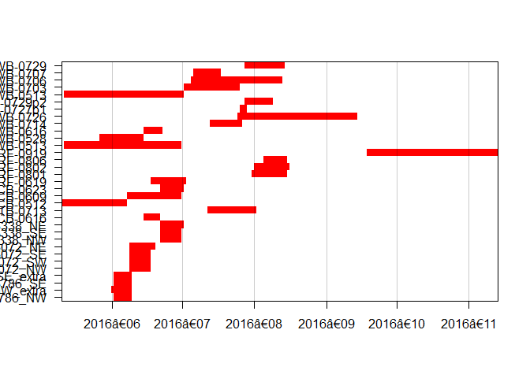
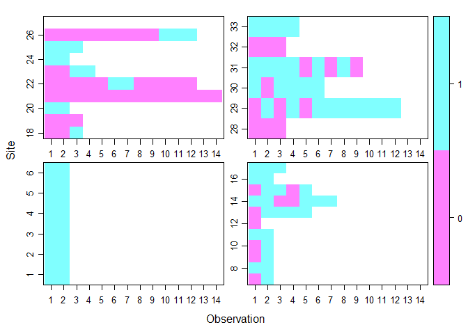
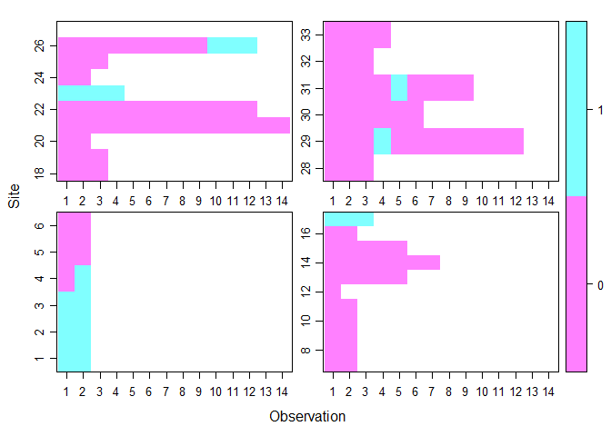
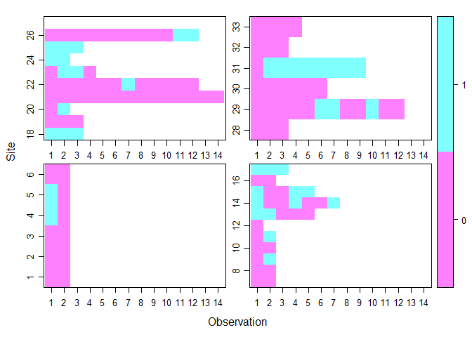

Occupancy Analysis
================
burkeprw
November 27, 2017

First, load packages.

``` r
suppressPackageStartupMessages(library(tidyverse))
suppressPackageStartupMessages(library(lubridate))
suppressPackageStartupMessages(library(readr))
suppressPackageStartupMessages(library(forcats))
suppressPackageStartupMessages(library(camtrapR))
suppressPackageStartupMessages(library(unmarked))
suppressPackageStartupMessages(library(standardize))
```

### Step 1: Read Data in Wide Format for `unmarked`

I read the .rds file saved in [Task 1](https://github.com/burkeprw/rsh_zool500_bats/blob/master/r_scripts/t1_tidydata/ghd01_tidydata.md). I also read data files from BC Agricultural Land Use Inventory (ALUI) for cover type and land use data. It is necessary to make the following formatting adjustments to the .csv data:
- DateTimeOriginal column is formatted as YYYY-MM-DD hh:mm:ss in Excel before saving, then read into R using `format = "%Y-%m-%d %H:%M:%S`

I made the following edits to "all\_sitecovs.csv": - added BC ALUI landcovers
- added elevation from DEM
- changes Site names for NABat sites with year prefix - removed sites with NA start dates
- Added 14 iterations of the observation covariates: GLA and LAI.4

``` r
all_obs_full_read <- readRDS("C:/Users/prwb/Documents/_research_projects/admin_ubc_msc/_courses_wkshp/zool500_directedstudies/deliverables/00_github_zool500_bats/r_output/all_obs_comp.rds")

all_sitecovs <- read_csv("C:/Users/prwb/Documents/_research_projects/admin_ubc_msc/_courses_wkshp/zool500_directedstudies/deliverables/00_github_zool500_bats/data_copy/all_sitecovs_2016.csv")
all_sitecovs$D.1 <- yday(as.Date(all_sitecovs$D.1, "%Y-%m-%d")) # converts date to Julian number
all_sitecovs$D.2 <- yday(as.Date(all_sitecovs$D.2, "%Y-%m-%d"))
all_sitecovs$D.3 <- yday(as.Date(all_sitecovs$D.3, "%Y-%m-%d"))
all_sitecovs$D.4 <- yday(as.Date(all_sitecovs$D.4, "%Y-%m-%d"))
all_sitecovs$D.5 <- yday(as.Date(all_sitecovs$D.5, "%Y-%m-%d"))
all_sitecovs$D.6 <- yday(as.Date(all_sitecovs$D.6, "%Y-%m-%d"))
all_sitecovs$D.7 <- yday(as.Date(all_sitecovs$D.7, "%Y-%m-%d"))
all_sitecovs$D.8 <- yday(as.Date(all_sitecovs$D.8, "%Y-%m-%d"))
all_sitecovs$D.9 <- yday(as.Date(all_sitecovs$D.9, "%Y-%m-%d"))
all_sitecovs$D.10 <- yday(as.Date(all_sitecovs$D.10, "%Y-%m-%d"))
all_sitecovs$D.11 <- yday(as.Date(all_sitecovs$D.11, "%Y-%m-%d"))
all_sitecovs$D.12 <- yday(as.Date(all_sitecovs$D.12, "%Y-%m-%d"))
all_sitecovs$D.13 <- yday(as.Date(all_sitecovs$D.13, "%Y-%m-%d"))
all_sitecovs$D.14 <- yday(as.Date(all_sitecovs$D.14, "%Y-%m-%d"))
edit_sitecovs <- select(all_sitecovs,-LOTLNK.x,-COVLNKTXT.x,-LOCALGOVDI,-SURVEY_YEA,-BC_LOTLNK,
                        -BC_COVLNKT,-OBJECTID,-BC_COVLNKTXT,-LOCALGOVDISP,-LOTLNK.y,-COVLNKTXT.y,
                        -COVGRPTYPE1,-COVTYPE1,-COVGRPTYPE2,-COVTYPE2,-PRACODE,-IRRIGRPCODE,
                        -IRRIGCODE,-IRRIGNOTUSED,-IRRIGCODE2,-LIMITCODE)

sites_bats <- read_csv("C:/Users/prwb/Documents/_research_projects/admin_ubc_msc/_courses_wkshp/zool500_directedstudies/deliverables/00_github_zool500_bats/r_output/dat_allsites.csv")

sites <- left_join(sites_bats,edit_sitecovs,"Site")
sites_2016 <- sites %>%
  filter(Surv_yr == 2016)
sites_2016[c("det_model", "mic_type")][is.na(sites_2016[c("det_model", "mic_type")])] <- "UNKNOWN"

sites_2016$start_date <- as.Date(sites_2016$start_date, "%Y-%m-%d")
sites_2016$end_date <- as.Date(sites_2016$end_date, "%Y-%m-%d")

##Clean up Environment
rm(sites_bats)
rm(sites)
rm(all_sitecovs)
rm(edit_sitecovs)
```

Look at the distribution of sampling periods across time:

``` r
det_op <- data.frame(lapply(sites_2016, as.character), stringsAsFactors=FALSE)

detop <- cameraOperation(CTtable = det_op,           # Update with problems
                                   stationCol = "Site",
                                   setupCol = "start_date",
                                   retrievalCol = "end_date",
                                   writecsv = FALSE,
                                   hasProblems = TRUE,    #TEMP     
                                   dateFormat = "%Y-%m-%d"
                                   )

camopPlot <- function(camOp){
  which.tmp <- grep(as.Date(colnames(camOp)), pattern = "01$")
  label.tmp <- format(as.Date(colnames(camOp))[which.tmp], "%Y‐%m")
  at.tmp <- which.tmp / ncol(camOp)
  image(t(as.matrix(camOp)), xaxt = "n", yaxt = "n", col = c("red", "grey70"))
  axis(1, at = at.tmp, labels = label.tmp)
  axis(2, at = seq(from = 0, to = 1, length.out = nrow(camOp)), labels = rownames(camOp), las = 1)
  abline(v = at.tmp, col = rgb(0,0,0, 0.2))
  box()
}
camopPlot(camOp = detop)
```



I coerce the data using the package `camtrapR` and function 'detectionHistory()' to prepare for modeling. Date requirements for `unmarked` include 1st 3 columns in this order: site, date, and the occ/count variable, followed by detection periods. Here I use 4 day sample periods (occasionLength = 7).

Need to check for:
- missing data
- detector not working

Next, set up the covariate matrices.
- **Observation covariates:**
1. **Wind Speed** (EnvCan stations averaged over 4d); standardized using `standardize:scale()`
2. **Temperature** (EnvCan stations averaged over 4d); standardized using `standardize:scale()`
3. **Temperature** (EnvCan stations averaged over 4d); standardized using `standardize:scale()`
4. **Date**; standardized as a Julian day using `lubridate:yday()` and `standardize:scale()`
- **Site covariates:**
1. **GLA** (gap light)
2. **LAI.4** (leaf area index)
3. **Elevation**
4. **Microphone height**
5. **Microphone type**
6. **Detector model**

``` r
siteCovs <- sites_2016[,c("Site","LAI.4","LAI.5","GLA.x","Elev","det_model","mic_type","mic_ht")]
siteCovs[,2] <- scale(siteCovs$LAI.4) # standardize covariates
siteCovs[,3] <- scale(siteCovs$LAI.5)
siteCovs[,4] <- scale(siteCovs$GLA.x)
siteCovs[,5] <- scale(siteCovs$Elev)
siteCovs[,8] <- scale(siteCovs$mic_ht)
siteCovs_df <- as.data.frame(siteCovs)

#Remove rows without fisheye images for GLA/LAI
#siteCovs_subset <- filter(siteCovs, GLA.x != "NA")

wind <- scale(sites_2016[,c("W.1","W.2","W.3","W.4","W.5","W.6","W.7","W.8","W.9","W.10","W.11","W.12","W.13","W.14")])
#wind_ungroup <- ungroup(wind)
wind_df <- as.data.frame(wind)

temp <- scale(sites_2016[,c("T.1","T.2","T.3","T.4","T.5","T.6","T.7","T.8","T.9","T.10","T.11","T.12","T.13","T.14")])
#temp_ungroup <- ungroup(temp)
temp_df <- as.data.frame(temp)

precip <- scale(sites_2016[,c("P.1","P.2","P.3","P.4","P.5","P.6","P.7","P.8","P.9","P.10","P.11","P.12","P.13","P.14")])
#precip_ungroup <- ungroup(precip)
precip_df <- as.data.frame(precip)

date <- scale(sites_2016[,c("D.1","D.2","D.3","D.4","D.5","D.6","D.7","D.8","D.9","D.10","D.11","D.12","D.13","D.14")])
#date_ungroup <- ungroup(date)
date_df <- as.data.frame(date)
                           

obsCovs <- list(wind=wind_df, temp=temp_df, precip=precip_df, date=date_df)

# Clean up Environment
rm(siteCovs)
rm(temp)
rm(temp_df)
rm(wind)
rm(wind_df)
rm(precip)
rm(precip_df)
rm(date)
rm(date_df)
```

To do:
- Set up detection histories for TABR, LANO (detections outside date range)
- Remove NAs from observation covariates (GLA and LAI for folowing sites):
*073786\_SE
*143338\_SE
*143338\_NE
*CTB-0713
*FCB-0609
*FCB-0623
*FRF-0919
*LWB-0528
*LWB-0616
*LWB-0727p1
*UWB-0703
*UWB-0707
\*UWB-0729

### Occupancy Model 01: ***Myotis lucifugus*** (MYLU)

Here I run preliminary occupancy models and model selection for the endangered MYLU. For this species I show the full code, but remove it for other species below.

You can also embed plots, for example:

``` r
occMYLU <- read_csv("C:/Users/prwb/Documents/_research_projects/admin_ubc_msc/_courses_wkshp/zool500_directedstudies/deliverables/00_github_zool500_bats/r_output/rDetHist/DetHist_MYLU.csv", col_names = TRUE, 
                      col_types = cols(
                          X1 = col_character(),
                          o1 = col_logical(),
                          o2 = col_logical(),
                          o3 = col_logical(),
                          o4 = col_logical(),
                          o5 = col_logical(),
                          o6 = col_logical(),
                          o7 = col_logical(),
                          o8 = col_logical(),
                          o9 = col_logical(),
                          o10 = col_logical(),
                          o11 = col_logical(), 
                          o12 = col_logical(),
                          o13 = col_logical(),
                          o14 = col_logical()), locale = default_locale(), na = c("", "NA"))
y <- occMYLU[,2:15]

names(obsCovs) <- c("wind","temp","precip","date")

MyluUMF <- unmarkedFrameOccu(y = y, siteCovs = siteCovs_df, obsCovs = obsCovs)

summary(MyluUMF)
```

    ## unmarkedFrame Object
    ## 
    ## 33 sites
    ## Maximum number of observations per site: 14 
    ## Mean number of observations per site: 4.15 
    ## Sites with at least one detection: 27 
    ## 
    ## Tabulation of y observations:
    ## FALSE  TRUE  <NA> 
    ##    62    75   325 
    ## 
    ## Site-level covariates:
    ##      Site                LAI.4.V1            LAI.5.V1      
    ##  Length:33          Min.   :-0.696422   Min.   :-0.916657  
    ##  Class :character   1st Qu.:-0.616093   1st Qu.:-0.677529  
    ##  Mode  :character   Median :-0.479882   Median :-0.371977  
    ##                     Mean   : 0.000000   Mean   : 0.000000  
    ##                     3rd Qu.:-0.144593   3rd Qu.: 0.129528  
    ##                     Max.   : 2.167501   Max.   : 2.285000  
    ##                     NA's   :13          NA's   :13         
    ##       GLA.x.V1             Elev.V1         det_model        
    ##  Min.   :-1.752522   Min.   :-1.2218314   Length:33         
    ##  1st Qu.:-0.412087   1st Qu.:-1.1597880   Class :character  
    ##  Median : 0.068150   Median : 0.4378288   Mode  :character  
    ##  Mean   : 0.000000   Mean   : 0.0000000                     
    ##  3rd Qu.: 0.639398   3rd Qu.: 0.5877669                     
    ##  Max.   : 1.581813   Max.   : 2.2138203                     
    ##  NA's   :13                                                 
    ##    mic_type              mic_ht.V1      
    ##  Length:33          Min.   :-2.5784438  
    ##  Class :character   1st Qu.:-0.3601178  
    ##  Mode  :character   Median :-0.3601178  
    ##                     Mean   : 0.0000000  
    ##                     3rd Qu.: 0.2736896  
    ##                     Max.   : 2.1751118  
    ##                                         
    ## 
    ## Observation-level covariates:
    ##       wind               temp              precip             date        
    ##  Min.   :-2.01823   Min.   :-3.22079   Min.   :-1.0439   Min.   :-1.5666  
    ##  1st Qu.:-0.64367   1st Qu.:-0.68858   1st Qu.:-0.5864   1st Qu.:-0.6016  
    ##  Median :-0.07289   Median : 0.02075   Median :-0.4470   Median :-0.1191  
    ##  Mean   : 0.00000   Mean   : 0.00000   Mean   : 0.0000   Mean   : 0.0000  
    ##  3rd Qu.: 0.71523   3rd Qu.: 0.66909   3rd Qu.: 0.3688   3rd Qu.: 0.6047  
    ##  Max.   : 3.21243   Max.   : 2.07853   Max.   : 4.7767   Max.   : 2.9139  
    ##  NA's   :6          NA's   :2

``` r
plot(MyluUMF, panels = 4)
```



``` r
# Double right-hand side formula describing covariates of detection and occupancy in that order
fm0101 <- occu(~ 1 ~ 1, MyluUMF)
fm0102 <- occu(~ 1 ~ Elev, MyluUMF)
fm0103 <- occu(~ 1 ~ LAI.4, MyluUMF)
fm0104 <- occu(~ 1 ~ LAI.5, MyluUMF)
fm0105 <- occu(~ 1 ~ GLA.x, MyluUMF)
fm0106 <- occu(~ 1 ~ LAI.4 + GLA.x, MyluUMF)
fm0107 <- occu(~ det_model ~ 1, MyluUMF)
fm0108 <- occu(~ mic_type ~ 1, MyluUMF)
fm0109 <- occu(~ det_model + mic_type ~ 1, MyluUMF)
fm0110 <- occu(~ mic_ht ~ 1, MyluUMF)
fm0111 <- occu(~ precip ~ 1, MyluUMF)
fm0112 <- occu(~ temp ~ 1, MyluUMF)
fm0113 <- occu(~ wind ~ 1, MyluUMF)
fm0114 <- occu(~ date ~ 1, MyluUMF)
#fm0114 <- occu(~ 1 ~precip, MyluUMF)
#fm0114 <- occu(~ 1 ~temp, MyluUMF)
#fm0114 <- occu(~ 1 ~wind, MyluUMF)
#fm0114 <- occu(~ 1 ~ date, MyluUMF)

#fm5 <- occu(~ 1 ~ Elev, myluUMF, starts=c(100,1000,0))# how to improve starting values?
#fm6 <- occu(~ 1 ~ habitat, myluUMF)

## Model Selection
fmsMYLU <- fitList('psi(.)p(.)' = fm0101,
               'psi(elevation)p(.)' = fm0102,
#               'psi(leaf area index 4)p(.)' = fm0103,
#               'psi(leaf area index 5)p(.)' = fm0104,
#               'psi(gap light)p(.)' = fm0105,
#               'psi(leaf area index 4 + gap light)p(.)' = fm0106,
               'psi(.)p(detector model)' = fm0107,
               'psi(.)p(mic type)' = fm0108,
               'psi(.)p(detector + mic)' = fm0109,
               'psi(.)p(mic height)' = fm0110,
               'psi(.)p(precipitation)' = fm0111,
#               'psi(.)p(temperature)' = fm0112,
#               'psi(.)p(wind gust)' = fm0113,
               'psi(.)p(date)' = fm0114
               )
modSel(fmsMYLU)
```

    ##                         nPars    AIC delta  AICwt cumltvWt
    ## psi(.)p(mic height)         3 165.78 0.000 0.3437     0.34
    ## psi(.)p(mic type)           5 165.81 0.025 0.3395     0.68
    ## psi(.)p(detector model)     4 167.40 1.620 0.1529     0.84
    ## psi(.)p(detector + mic)     7 168.00 2.211 0.1138     0.95
    ## psi(.)p(precipitation)      3 170.92 5.132 0.0264     0.98
    ## psi(.)p(.)                  2 172.29 6.502 0.0133     0.99
    ## psi(elevation)p(.)          3 174.03 8.248 0.0056     1.00
    ## psi(.)p(date)               3 174.28 8.496 0.0049     1.00

``` r
# Top model
fm0110
```

    ## 
    ## Call:
    ## occu(formula = ~mic_ht ~ 1, data = MyluUMF)
    ## 
    ## Occupancy:
    ##  Estimate    SE    z P(>|z|)
    ##      1.96 0.589 3.33 0.00088
    ## 
    ## Detection:
    ##             Estimate    SE     z  P(>|z|)
    ## (Intercept)    0.987 0.270  3.65 0.000262
    ## mic_ht        -0.577 0.215 -2.68 0.007264
    ## 
    ## AIC: 165.7846

### Occupancy Model 02: ***Myotis yumanensis*** (MYYU)

Here I run preliminary occupancy models and model selection for MYYU. Summary statistics for covariates, AIC model selection, and top model are shown below. Model code can be found [here](https://github.com/burkeprw/rsh_zool500_bats/blob/master/r_scripts/t2_occupancy/ghd02_occupancy.Rmd).

    ## unmarkedFrame Object
    ## 
    ## 33 sites
    ## Maximum number of observations per site: 14 
    ## Mean number of observations per site: 4.15 
    ## Sites with at least one detection: 9 
    ## 
    ## Tabulation of y observations:
    ## FALSE  TRUE  <NA> 
    ##   118    19   325 
    ## 
    ## Site-level covariates:
    ##      Site                LAI.4.V1            LAI.5.V1      
    ##  Length:33          Min.   :-0.696422   Min.   :-0.916657  
    ##  Class :character   1st Qu.:-0.616093   1st Qu.:-0.677529  
    ##  Mode  :character   Median :-0.479882   Median :-0.371977  
    ##                     Mean   : 0.000000   Mean   : 0.000000  
    ##                     3rd Qu.:-0.144593   3rd Qu.: 0.129528  
    ##                     Max.   : 2.167501   Max.   : 2.285000  
    ##                     NA's   :13          NA's   :13         
    ##       GLA.x.V1             Elev.V1         det_model        
    ##  Min.   :-1.752522   Min.   :-1.2218314   Length:33         
    ##  1st Qu.:-0.412087   1st Qu.:-1.1597880   Class :character  
    ##  Median : 0.068150   Median : 0.4378288   Mode  :character  
    ##  Mean   : 0.000000   Mean   : 0.0000000                     
    ##  3rd Qu.: 0.639398   3rd Qu.: 0.5877669                     
    ##  Max.   : 1.581813   Max.   : 2.2138203                     
    ##  NA's   :13                                                 
    ##    mic_type              mic_ht.V1      
    ##  Length:33          Min.   :-2.5784438  
    ##  Class :character   1st Qu.:-0.3601178  
    ##  Mode  :character   Median :-0.3601178  
    ##                     Mean   : 0.0000000  
    ##                     3rd Qu.: 0.2736896  
    ##                     Max.   : 2.1751118  
    ##                                         
    ## 
    ## Observation-level covariates:
    ##       wind               temp              precip             date        
    ##  Min.   :-2.01823   Min.   :-3.22079   Min.   :-1.0439   Min.   :-1.5666  
    ##  1st Qu.:-0.64367   1st Qu.:-0.68858   1st Qu.:-0.5864   1st Qu.:-0.6016  
    ##  Median :-0.07289   Median : 0.02075   Median :-0.4470   Median :-0.1191  
    ##  Mean   : 0.00000   Mean   : 0.00000   Mean   : 0.0000   Mean   : 0.0000  
    ##  3rd Qu.: 0.71523   3rd Qu.: 0.66909   3rd Qu.: 0.3688   3rd Qu.: 0.6047  
    ##  Max.   : 3.21243   Max.   : 2.07853   Max.   : 4.7767   Max.   : 2.9139  
    ##  NA's   :6          NA's   :2



    ##                         nPars    AIC delta   AICwt cumltvWt
    ## psi(.)p(mic height)         3  80.39  0.00 9.0e-01     0.90
    ## psi(.)p(mic type)           5  85.08  4.69 8.6e-02     0.98
    ## psi(.)p(detector + mic)     7  88.21  7.83 1.8e-02     1.00
    ## psi(.)p(detector model)     4  97.83 17.44 1.5e-04     1.00
    ## psi(.)p(date)               3 100.30 19.91 4.3e-05     1.00
    ## psi(elevation)p(.)          3 100.35 19.96 4.1e-05     1.00
    ## psi(.)p(.)                  2 100.74 20.35 3.4e-05     1.00
    ## psi(.)p(precipitation)      3 102.48 22.09 1.4e-05     1.00

    ## 
    ## Call:
    ## occu(formula = ~mic_ht ~ 1, data = MyyuUMF)
    ## 
    ## Occupancy:
    ##  Estimate    SE     z P(>|z|)
    ##    -0.857 0.403 -2.13  0.0331
    ## 
    ## Detection:
    ##             Estimate    SE     z  P(>|z|)
    ## (Intercept)     1.68 0.771  2.18 0.029087
    ## mic_ht         -2.34 0.661 -3.55 0.000389
    ## 
    ## AIC: 80.3875

### Occupancy Model 03: ***Myotis evotis*** (MYEV)

Here I run preliminary occupancy models and model selection for the clutter adapted forest bat MYEV.

    ## unmarkedFrame Object
    ## 
    ## 33 sites
    ## Maximum number of observations per site: 14 
    ## Mean number of observations per site: 4.15 
    ## Sites with at least one detection: 17 
    ## 
    ## Tabulation of y observations:
    ## FALSE  TRUE  <NA> 
    ##    97    40   325 
    ## 
    ## Site-level covariates:
    ##      Site                LAI.4.V1            LAI.5.V1      
    ##  Length:33          Min.   :-0.696422   Min.   :-0.916657  
    ##  Class :character   1st Qu.:-0.616093   1st Qu.:-0.677529  
    ##  Mode  :character   Median :-0.479882   Median :-0.371977  
    ##                     Mean   : 0.000000   Mean   : 0.000000  
    ##                     3rd Qu.:-0.144593   3rd Qu.: 0.129528  
    ##                     Max.   : 2.167501   Max.   : 2.285000  
    ##                     NA's   :13          NA's   :13         
    ##       GLA.x.V1             Elev.V1         det_model        
    ##  Min.   :-1.752522   Min.   :-1.2218314   Length:33         
    ##  1st Qu.:-0.412087   1st Qu.:-1.1597880   Class :character  
    ##  Median : 0.068150   Median : 0.4378288   Mode  :character  
    ##  Mean   : 0.000000   Mean   : 0.0000000                     
    ##  3rd Qu.: 0.639398   3rd Qu.: 0.5877669                     
    ##  Max.   : 1.581813   Max.   : 2.2138203                     
    ##  NA's   :13                                                 
    ##    mic_type              mic_ht.V1      
    ##  Length:33          Min.   :-2.5784438  
    ##  Class :character   1st Qu.:-0.3601178  
    ##  Mode  :character   Median :-0.3601178  
    ##                     Mean   : 0.0000000  
    ##                     3rd Qu.: 0.2736896  
    ##                     Max.   : 2.1751118  
    ##                                         
    ## 
    ## Observation-level covariates:
    ##       wind               temp              precip             date        
    ##  Min.   :-2.01823   Min.   :-3.22079   Min.   :-1.0439   Min.   :-1.5666  
    ##  1st Qu.:-0.64367   1st Qu.:-0.68858   1st Qu.:-0.5864   1st Qu.:-0.6016  
    ##  Median :-0.07289   Median : 0.02075   Median :-0.4470   Median :-0.1191  
    ##  Mean   : 0.00000   Mean   : 0.00000   Mean   : 0.0000   Mean   : 0.0000  
    ##  3rd Qu.: 0.71523   3rd Qu.: 0.66909   3rd Qu.: 0.3688   3rd Qu.: 0.6047  
    ##  Max.   : 3.21243   Max.   : 2.07853   Max.   : 4.7767   Max.   : 2.9139  
    ##  NA's   :6          NA's   :2



    ##                         nPars    AIC delta AICwt cumltvWt
    ## psi(.)p(precipitation)      3 153.12  0.00 0.511     0.51
    ## psi(.)p(mic type)           5 154.76  1.63 0.226     0.74
    ## psi(.)p(detector + mic)     7 157.26  4.13 0.065     0.80
    ## psi(.)p(date)               3 157.43  4.30 0.059     0.86
    ## psi(.)p(mic height)         3 157.61  4.49 0.054     0.91
    ## psi(.)p(detector model)     4 158.60  5.47 0.033     0.95
    ## psi(.)p(.)                  2 158.86  5.74 0.029     0.98
    ## psi(elevation)p(.)          3 159.28  6.15 0.024     1.00

### Session Info

``` r
sessionInfo()
```

    ## R version 3.4.1 (2017-06-30)
    ## Platform: x86_64-w64-mingw32/x64 (64-bit)
    ## Running under: Windows 10 x64 (build 15063)
    ## 
    ## Matrix products: default
    ## 
    ## locale:
    ## [1] LC_COLLATE=English_United States.1252 
    ## [2] LC_CTYPE=English_United States.1252   
    ## [3] LC_MONETARY=English_United States.1252
    ## [4] LC_NUMERIC=C                          
    ## [5] LC_TIME=English_United States.1252    
    ## 
    ## attached base packages:
    ## [1] parallel  stats     graphics  grDevices utils     datasets  methods  
    ## [8] base     
    ## 
    ## other attached packages:
    ##  [1] bindrcpp_0.2      standardize_0.2.1 unmarked_0.12-2  
    ##  [4] Rcpp_0.12.11      lattice_0.20-35   reshape_0.8.6    
    ##  [7] camtrapR_0.99.8   forcats_0.2.0     lubridate_1.6.0  
    ## [10] dplyr_0.7.3       purrr_0.2.3       readr_1.1.1      
    ## [13] tidyr_0.6.3       tibble_1.3.3      ggplot2_2.2.1    
    ## [16] tidyverse_1.1.1  
    ## 
    ## loaded via a namespace (and not attached):
    ##  [1] httr_1.2.1        jsonlite_1.5      splines_3.4.1    
    ##  [4] foreach_1.4.3     bold_0.4.0        modelr_0.1.1     
    ##  [7] assertthat_0.2.0  sp_1.2-5          taxize_0.8.9     
    ## [10] cellranger_1.1.0  yaml_2.1.14       backports_1.1.0  
    ## [13] glue_1.1.1        digest_0.6.12     rvest_0.3.2      
    ## [16] minqa_1.2.4       colorspace_1.3-2  htmltools_0.3.6  
    ## [19] Matrix_1.2-10     plyr_1.8.4        psych_1.7.8      
    ## [22] ritis_0.5.4       pkgconfig_2.0.1   broom_0.4.2      
    ## [25] raster_2.5-8      haven_1.1.0       scales_0.4.1     
    ## [28] lme4_1.1-13       mgcv_1.8-17       secr_3.0.1       
    ## [31] lazyeval_0.2.0    mnormt_1.5-5      magrittr_1.5     
    ## [34] readxl_1.0.0      evaluate_0.10.1   nlme_3.1-131     
    ## [37] MASS_7.3-47       xml2_1.1.1        foreign_0.8-69   
    ## [40] tools_3.4.1       data.table_1.10.4 hms_0.3          
    ## [43] stringr_1.2.0     munsell_0.4.3     compiler_3.4.1   
    ## [46] rlang_0.1.2       overlap_0.3.0     grid_3.4.1       
    ## [49] nloptr_1.0.4      iterators_1.0.8   rmarkdown_1.6    
    ## [52] gtable_0.2.0      codetools_0.2-15  abind_1.4-5      
    ## [55] reshape2_1.4.2    R6_2.2.2          knitr_1.16       
    ## [58] rgdal_1.2-8       bindr_0.1         rprojroot_1.2    
    ## [61] ape_4.1           stringi_1.1.5
